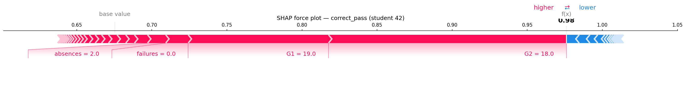
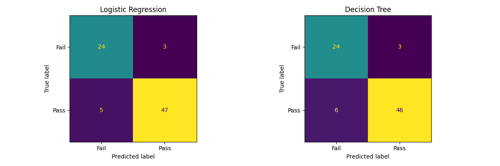

# Student Pass/Fail Predictor

Predicts whether a student will pass or fail based on academic and lifestyle factors.

## Problem
Teachers and counselors have no easy way to identify at-risk students early. 
This tool predicts pass/fail outcomes so interventions can happen sooner.

## Interesting finding
[e.g. "Past failures was the strongest predictor of outcome — 
students with 2+ failures had an 87% fail rate regardless of study time"]

## Model comparison
| Model | Accuracy | F1 Score |
|-------|----------|----------|
| Random Forest |  91% |  0.93 |
| Logistic Regression | 90%  |  0.92 |
| Decision Tree | 89% | 0.91 |

## SHAP analysis


## Feature importance


## Feature importance


## Confusion Matrix


## Live demo
[Open the app](https://student-pass-prediction-ml-mmxta96xha4rayghktpoew.streamlit.app/)

## Run locally
```bash
git clone https://github.com/yourusername/student-pass-prediction-ml
cd student-pass-prediction-ml
pip install -r requirements.txt
streamlit run app.py
```